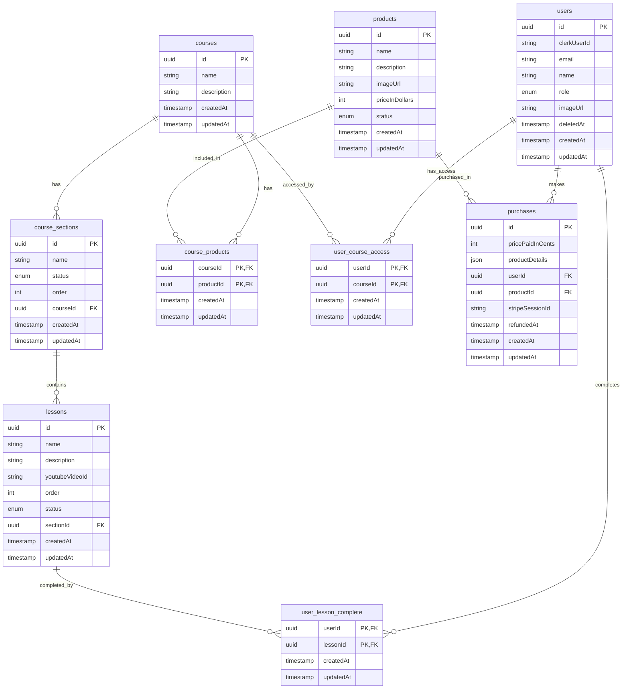

```mermaid
erDiagram
    users {
        uuid id PK
        string clerkUserId
        string email
        string name
        enum role
        string imageUrl
        timestamp deletedAt
        timestamp createdAt
        timestamp updatedAt
    }

    courses {
        uuid id PK
        string name
        string description
        timestamp createdAt
        timestamp updatedAt
    }

    course_sections {
        uuid id PK
        string name
        enum status
        int order
        uuid courseId FK
        timestamp createdAt
        timestamp updatedAt
    }

    lessons {
        uuid id PK
        string name
        string description
        string youtubeVideoId
        int order
        enum status
        uuid sectionId FK
        timestamp createdAt
        timestamp updatedAt
    }

    products {
        uuid id PK
        string name
        string description
        string imageUrl
        int priceInDollars
        enum status
        timestamp createdAt
        timestamp updatedAt
    }

    course_products {
        uuid courseId PK,FK
        uuid productId PK,FK
        timestamp createdAt
        timestamp updatedAt
    }

    user_course_access {
        uuid userId PK,FK
        uuid courseId PK,FK
        timestamp createdAt
        timestamp updatedAt
    }

    user_lesson_complete {
        uuid userId PK,FK
        uuid lessonId PK,FK
        timestamp createdAt
        timestamp updatedAt
    }

    purchases {
        uuid id PK
        int pricePaidInCents
        json productDetails
        uuid userId FK
        uuid productId FK
        string stripeSessionId
        timestamp refundedAt
        timestamp createdAt
        timestamp updatedAt
    }

    courses ||--o{ course_sections : "has"
    course_sections ||--o{ lessons : "contains"
    courses ||--o{ course_products : "has"
    products ||--o{ course_products : "included_in"
    users ||--o{ user_course_access : "has_access"
    courses ||--o{ user_course_access : "accessed_by"
    users ||--o{ user_lesson_complete : "completes"
    lessons ||--o{ user_lesson_complete : "completed_by"
    users ||--o{ purchases : "makes"
    products ||--o{ purchases : "purchased_in"
```
